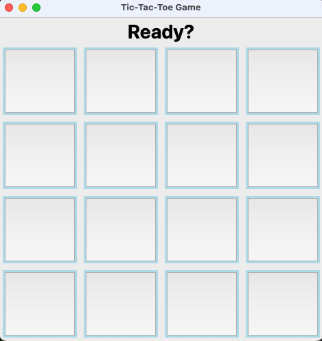
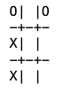

# IVB-511 Vize Projesi

GUI uzerinden Yapay zeka karsi oynayabilecegimiz bir TicTacToe uygulamasi gelistirme.

## 1. Installation


### 1.1 Macbook/Linux


```
pip3 install tk
```

Macbook kullanıyorsanız ve hata asagidaki hatayi aldiysaniz brew ile yuklemeyi deneyin:

```
Traceback (most recent call last):
  File "/Users/aakdemir/gedik_related/GU-YapayZeka-Guz2023/project_1/tictactoe.py", line 3, in <module>
    import tkinter as tk
  File "/usr/local/Cellar/python@3.11/3.11.6/Frameworks/Python.framework/Versions/3.11/lib/python3.11/tkinter/__init__.py", line 38, in <module>
    import _tkinter # If this fails your Python may not be configured for Tk
    ^^^^^^^^^^^^^^^
ModuleNotFoundError: No module named '_tkinter'
```

Çözüm:
```
brew install python-tk
```


### 1.2 Windows

Tkinter bilgisayarınızda yüklü olabilir. Değilse https://www.geeksforgeeks.org/how-to-install-tkinter-in-windows/


### 1.3 Run 

`project_1` folderinin icinde bir terminal baslat ve asagidaki kodu calistir: 

```bash
python tictactoe.py
```

Aşağıdaki arayüzü görüyor olmalıyız: 




## 2. Odev

(Not: Kodun bu versiyonu derste beraber yazdigimiz yaniti iceriyor. Bu sekilde teslim etmenizde bir sakinca yok. Yeni bir sey eklemeniz gerekmiyor.) Kendiniz baska bir algoritma implement etmek isterseniz o da olur :)) 

Amacimiz hazir verilen iskelet kodu modifiye ederek AI ile karsilikli oynamak. 
Algoritma olarak 5inci derste beraber kodladigimiz algoritmayi bu framework icine entegre edebilmenizi gormek istiyorum.

Kolaylik olmasi icin simdilik X oyuncusunun her zaman kendimiz, O oyuncusunun da her zaman AI olacagini dusunelim.
Yapay zekanin X oldugu oyunu kodlamanizi beklemiyorum.


### 2.1 Random hamle yapan yapay zeka (10 puan)

Success criteria: X'in her hamlesi icin herhangi bir geçerli hamle yapabilen bir yapay zeka.

Bu bolumde tek beklentim verilen iskelet kodu basit bir modifiye ederek O'nun geçerli hamleyi tahtaya eklemeniz.
Algoritmanın en iyi hamleyi bulmasına gerek yok.


### 2.2 Minimax kullanan yapay zeka (70 puan)

Success criteria: 3'e 3 tahtada hicbir zaman yenilmeyen ve X hata yaparsa her zaman oyunu kazanan yapay zeka

Bu bolumde beklentim 5inci haftada yazdıgımız minimax algoritmasını bu koda entegre edebilmeniz.
Ödevin en temel kısmı burası

### 2.3 En az hamlede kazanan varyasyonlari her zaman bulan Yapay zeka (20 puan)

Success criteria: 3'e 3 tahtada her zaman en az hamlede oyunu kazanacak hamleyi bulabilen yapay zeka

Bu bolumde beklentim yine 5inci haftada yazdığımız (`minimax_with_length`) geliştirmeyi bu kodun içine entegre edebilmeniz.

Örneğin yazdığınız programın aşağıdaki pozisyonda en az hamlede kazanan varyasyonu seçmesini bekliyorum:




### 2.4 4'e 4 veya 5'e 5 tahtada oynamak (Bonus: 15 puan)

`BOARD_SIZE` parametresi tahtanın kaça kaç olduğunu belirtiyor. 

Bu bolumde asagidaki sorulari yanitlamanizi bekliyorum:

- 2.2'de yazdiginiz algoritma  NxN (4'e 4, 5'e 5 veya daha fazla) bir tahtada da kusursuz calisir mi?
- 4'e 4 veya 5'e 5 tahtada dogru hamleyi bulmasi icin kac pozisyonu incelemek zorunda ve bilgisayarinizda bu ne kadar surdu?
- NxN tahtada 1 saniyede hamle yapmamiz zorunlu olursa, iyi bir hamleyi nasil bulabiliriz? Burada derste ogrendigimiz `evaluation function` konseptinden bahsetmenizi ve oyun sonuna kadar gitmeden de iyi bir hamle bulabilen bir cozum onermenizi bekliyorum. Bu cozumu kodlamaniza gerek yok. 

### 2.5 X veya O opsiyonu (Bonus: 15 puan)

Bu bölümde beklentim kullanıcı arayüzüne bir buton ekleyip oyuncunun X veya O olmasını seçilebilir yapmak.

Bu kesinlikle yapay zekayla ilişkili değil. Yalnızca kodlama pratiğinizi geliştirmeniz için bir bonus adım.

Oyuncu hangi tarafı seçerse, yapay zeka rakibi oynamalı. Eğer kullanıcı O seçtiyse ilk hamle yapay zeka tarafından yapılmalı. X her zaman ilk hamleyi yapmalı.

## 3. Ödev Teslimi

Ödev kodunu ve sorular verdiğiniz yazılı yanıtları tek bir folderda isim_soyisim.zip dosyası şeklinde ardaakdemir1@gmail.com email adresine gönderiniz. Konu: "[Isim Soyisim] IVB-511 Vize Projesi" olmali.

Eğer çözerseniz, 2.4 bölümündeki yazılı soruları herhangi başka bir dökümana yazıp aynı zip dosyasına ekleyin.

